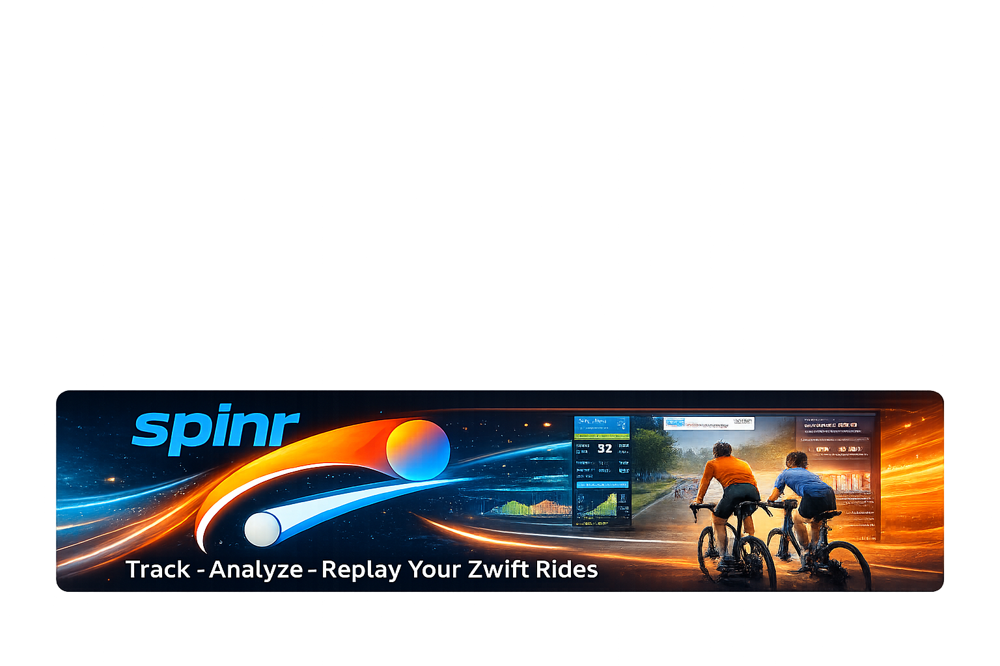

<p align="center">
  
</p>

<p align="center">
  <strong>A self-hosted cycling performance dashboard for Zwift riders.</strong><br>
  Track activities, analyze fitness trends, and replay your races in 2D.
</p>

<p align="center">
  <a href="https://hub.docker.com/r/xonbul/spinr"></a>
  <a href="https://github.com/fberinger/spinr/actions"></a>
  <a href="https://github.com/fberinger/spinr/blob/main/LICENSE"></a>
</p>

---

## Features

**Calendar & Activity Tracking** — Browse your rides in month or week view. Each activity shows duration, distance, power, heart rate, and power zone distribution at a glance.

**Charts & Analytics** — Dive into your fitness with power curves, weekly training load, fitness & form trends, cumulative distance, Eddington number, and zone breakdowns. Filter by 4 weeks, 3 months, 1 year, or all time.

**Race Replay** — Relive your races on a 2D map with animated rider positions. Follow any rider, scrub through the timeline, and watch the leaderboard update in real time with elevation profiles.

## Quick Start

### Docker Compose

```yaml
services:
  spinr:
    image: xonbul/spinr:latest
    container_name: spinr
    restart: unless-stopped
    ports:
      - "3000:3000"
```

```bash
docker compose up -d
```

Open [http://localhost:3000](http://localhost:3000) and connect your account.

### Unraid

1. Go to the **Docker** tab and add a new container
2. Set repository to `xonbul/spinr:latest`
3. Map port `3000 → 3000`
4. Start the container

## Development

```bash
npm install
npm run dev
```

The app runs at [http://localhost:5173](http://localhost:5173).

## Tech Stack

- **Frontend**: SvelteKit, Tailwind CSS, bits-ui
- **Charts**: Custom SVG/Canvas rendering
- **Race Replay**: HTML5 Canvas with 2D map visualization
- **Deployment**: Docker (Node 20 Alpine)
